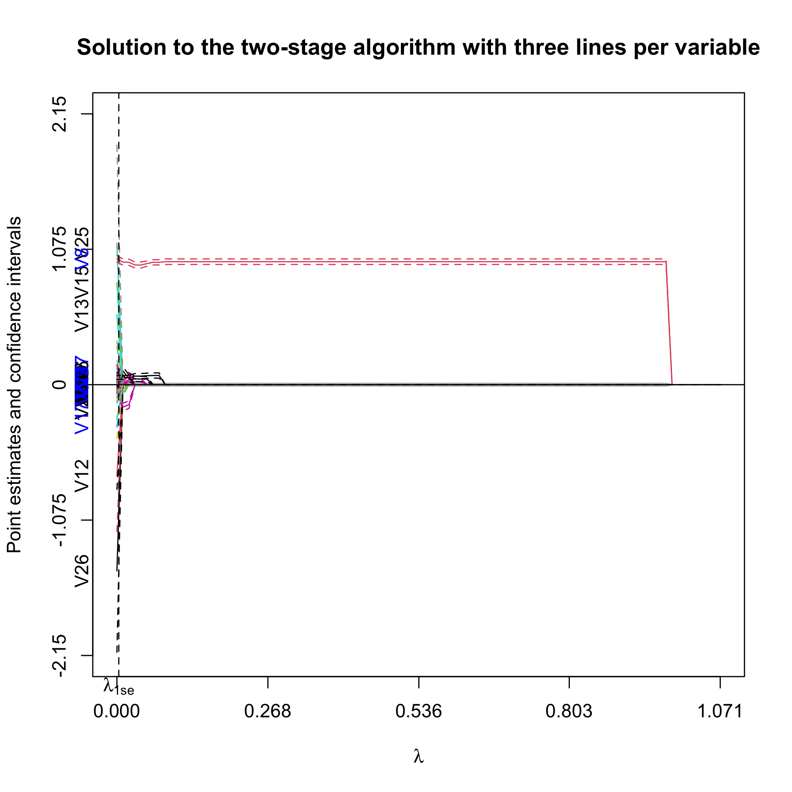
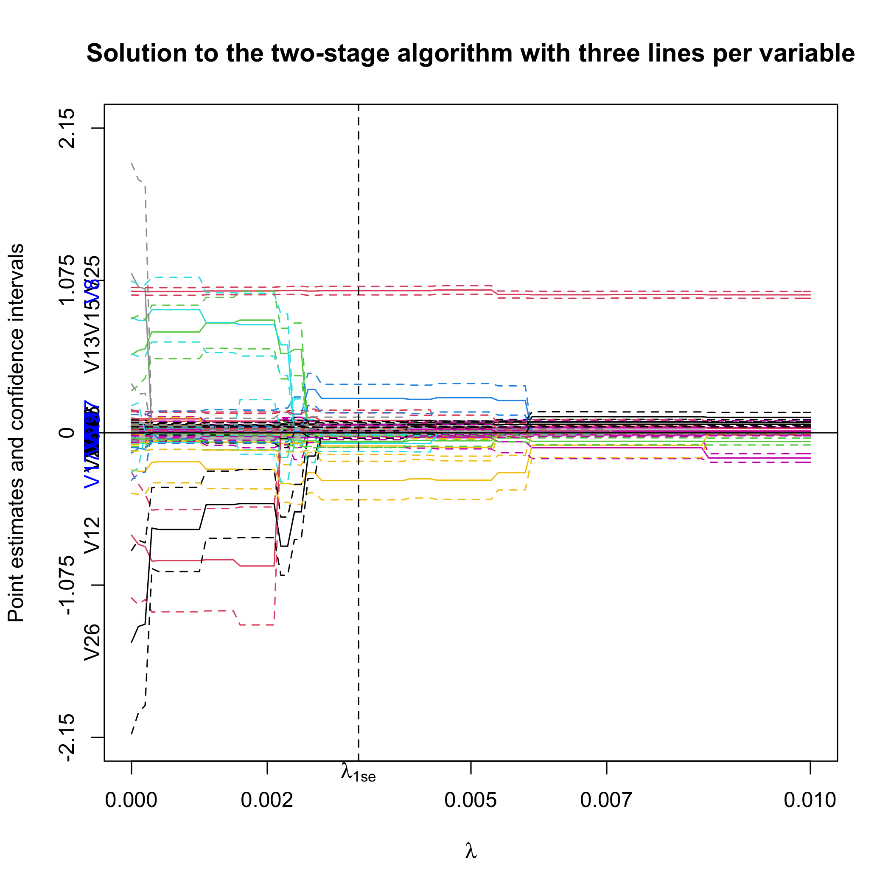
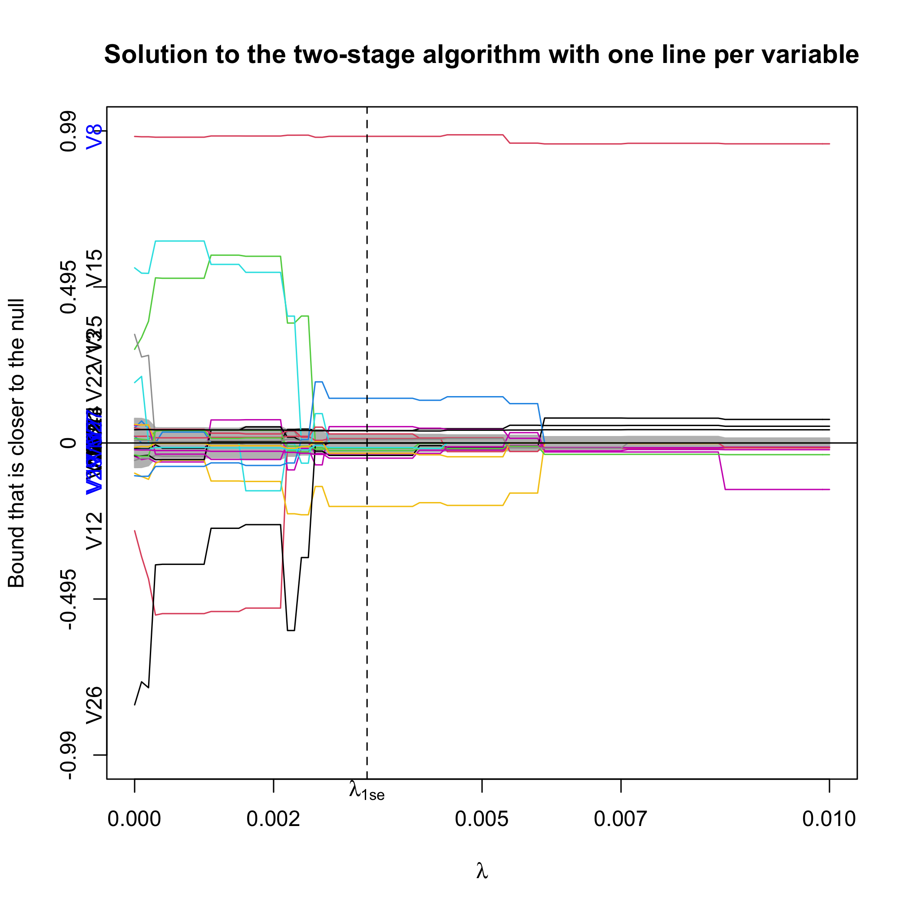

ProSGPV
========
Penalized Regression with Second-Generation P-Values

## Introduction

We know that p-values can't be used for variable selection. However, you can do so with second-generation p-values. Here is how.

## Installation

``` r
library(devtools)
devtools::install_github("zuoyi93/ProSGPV")
```

## Example

Here, we use the Tehran housing data as an illustrative example. This data set contains 26 explanatory variables and one outcome. More details can be found at . 

At the end of this section, we also provide an illustration with fewer variables that is discussed in the paper in the [references](#ref).

### One-stage algorithm

``` r
# load the package
library(ProSGPV)

# prepare the data
x = t.housing[,-ncol(t.housing)]
y = t.housing$V9

# run one-stage algorithm
out.sgpv.1 <- pro.sgpv(x = x, y = y, stage = 1)
```

First, let's see the variable selection results using the one-stage algorithm.

``` r
out.sgpv.1
```

    ## Selected variables are V8 V12 V13 V15 V17 V25 V26

We can also extract indices of variables selected

``` r
out.sgpv.1$var.index
```

    ## [1]  7  9 10 12 14 22 23


Now let's view the summary of the OLS model on those selected variables. 

``` r
summary(out.sgpv.1)
```

	## Call:
	## lm(formula = Response ~ ., data = lm.d)
	##
	## Residuals:
	##     Min       1Q   Median       3Q      Max 
	## -1226.05   -69.43    -7.74    53.65  1431.54 
	##
	## Coefficients:
	##               Estimate Std. Error t value Pr(>|t|)    
	## (Intercept)  7.745e+01  5.775e+01   1.341 0.180694    
	## V8           1.209e+00  1.323e-02  91.416  < 2e-16 ***
	## V12         -2.552e+01  2.624e+00  -9.725  < 2e-16 ***
	## V13          1.899e+01  2.532e+00   7.497 5.01e-13 ***
	## V15          2.033e-03  1.478e-04  13.759  < 2e-16 ***
	## V17         -3.289e+00  8.799e-01  -3.738 0.000216 ***
	## V25          1.135e+01  5.626e+00   2.018 0.044327 *  
	## V26         -1.436e+01  5.112e+00  -2.809 0.005240 ** 
	## ---
	## Signif. codes:  0 ‘***’ 0.001 ‘**’ 0.01 ‘*’ 0.05 ‘.’ 0.1 ‘ ’ 1
	## 
	## Residual standard error: 194 on 364 degrees of freedom
	## Multiple R-squared:  0.9746,	Adjusted R-squared:  0.9741 
	## F-statistic:  1997 on 7 and 364 DF,  p-value: < 2.2e-16


We can extract the point estimates by  

``` r
coef(out.sgpv.1)
```

We can get the predicted values by

``` r
predict(out.sgpv.1)
```

### Two-stage algorithm 

We can also use the two-algorithm on the data to gain better parameter estimates.  

``` r
out.sgpv.2 <- pro.sgpv(x = x, y = y, stage = 2)
```
The two-stage algorithm selects the following variables.

``` r
out.sgpv.2
```

    ## Selected variables are V8 V12 V13 V15 V17 V26

S3 method `plot` is available for the two-stage algorithm.

``` r
plot(out.sgpv.2)
```
First, we plot the full solution path with point estimates and 95% confidence intervals. Note that the null region is in sky blue. The selected variables are colored blue on the y-axis.



We can also zoom in to have a closer look.  

``` r
plot(out.sgpv.2,lambda.max=0.01)
```



Alternatively, we can plot the confidence bound that is closer to the null.

``` r
plot(out.sgpv.2,lpv=1,lambda.max=0.01)
```



### Simulation data 

Below is the figure with fewer variables that is shown in the paper down below. Only V3 is the true signal that generates the response. Fully relaxed lasso would have selected both V3 and V4, while our SGPV approach would only select V3.


## References <a name="ref"></a>

The paper that proposed the one- and two-stage algorithms:  

	Zuo Y, Stewart TG, Blume JD. Variable Selection with Second-Generation P-Values. arXiv preprint arXiv:2012.07941. 2020 Dec 15.

The papers regarding the second-generation p-values:  

	Blume JD, Greevy RA, Welty VF, Smith JR, Dupont WD. An introduction to second-generation p-values. The American Statistician. 2019 Mar 29;73(sup1):157-67.

	Blume JD, D’Agostino McGowan L, Dupont WD, Greevy Jr RA. Second-generation p-values: Improved rigor, reproducibility, & transparency in statistical analyses. PLoS One. 2018 Mar 22;13(3):e0188299.

