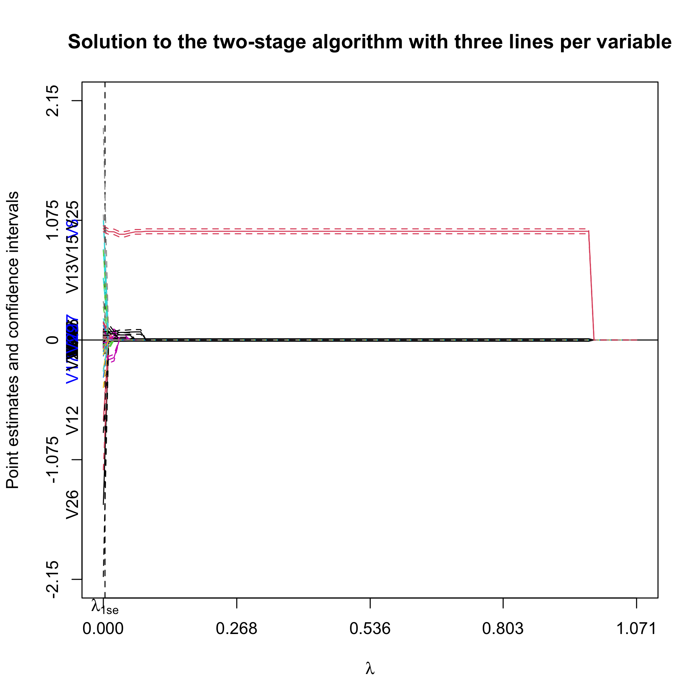
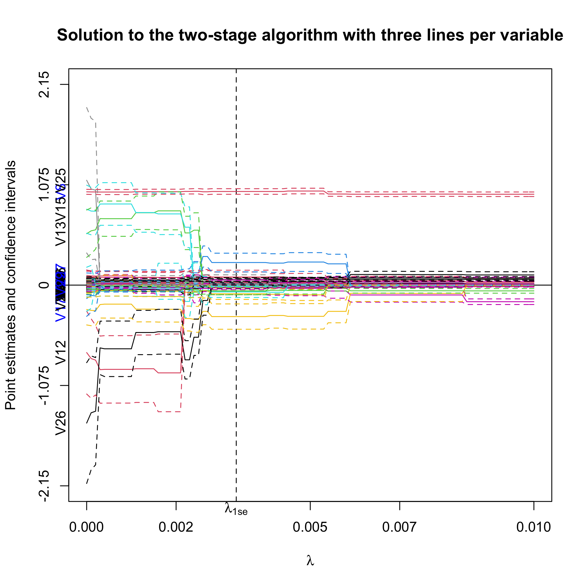
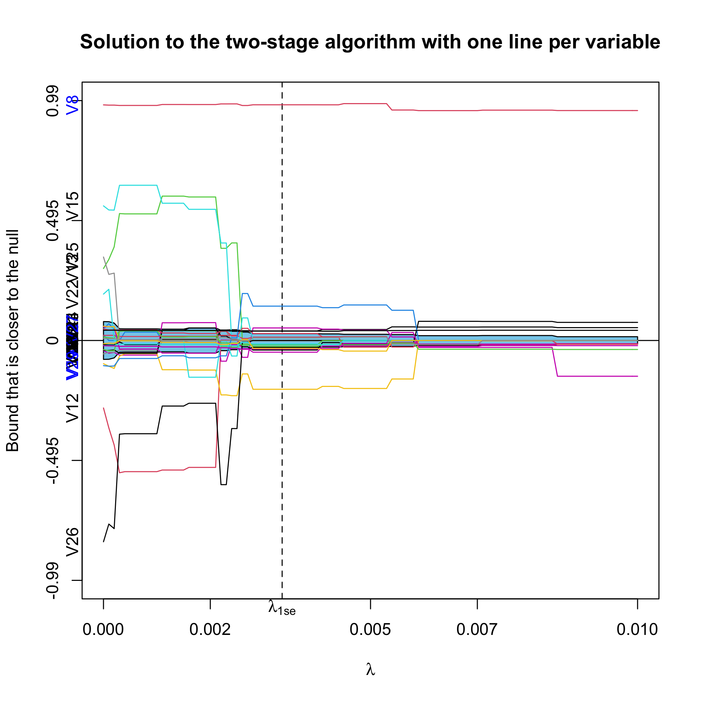

ProSGPV
========
Penalized Regression with Second Generation P Values

## Installation

``` r
library(devtools)
devtools::install_github("zuoyi93/ProSGPV")
```

## Example


``` r
# load the package
library(ProSGPV)

# prepare the data
x = t.housing[,-ncol(t.housing)]
y = t.housing$V9

# run one-stage algorithm
out.sgpv.1 <- pro.sgpv(x = x, y = y, stage = 1)

# show the variable selection results
out.sgpv.1
```

    ## Selected variables are V8 V12 V13 V15 V17 V25 V26

``` r
# get indices of variables selected
out.sgpv.1$var.index

```

    ## [1]  7  9 10 12 14 22 23

``` r
# extract OLS estimates
coef(out.sgpv.1)

```

    ##  (Intercept)            V8           V12           V13           V15           V17 
	## 77.448446890   1.209306136 -25.521519547  18.986926936   0.002033393  -3.288626450 
	##          V25           V26 
	## 11.352512518 -14.357918688 

``` r
# get prediction from the model
predict(out.sgpv.1)
```

``` r
# two-stage algorithm
out.sgpv.2 <- pro.sgpv(x = x, y = y, stage = 2)

# plot the fully relaxed lasso solution path and final solution
plot(out.sgpv.2,lpv=3)
```
First, we plot the full solution path with point estimates and 95% confidence intervals. Note that the null region is in sky blue. The selected variables are colored blue on the y-axis.



We can also zoom in to have a closer look.  

``` r
plot(out.sgpv.2,lpv=3,lambda.max=0.01)
```



Alternatively, we can plot the confidence bound that is closer to the null.

``` r
plot(out.sgpv.2,lpv=1,lambda.max=0.01)
```




## Reference


