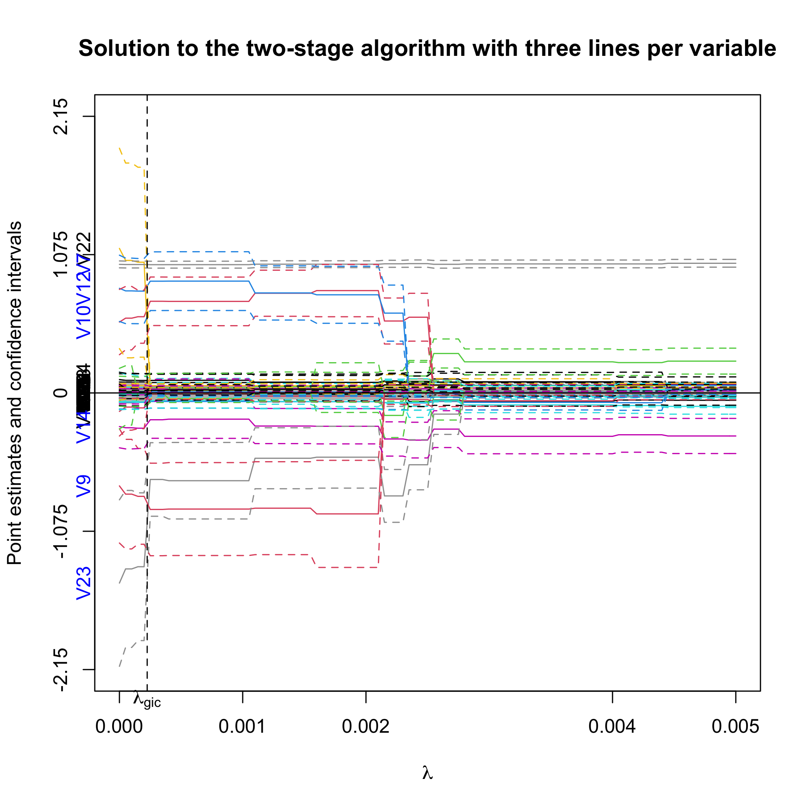

ProSGPV
========
Penalized Regression with Second-Generation P-Values

- [1. Introduction](#1-introduction)
- [2. Installation](#2-installation)
- [3. Example](#3-example)
  * [3.1 How ProSGPV works](#31-how-prosgpv-works)
  * [3.2 Real-world-data](#32-real-world-data)
    + [3.2.1 Two-stage-algorithm](#321-two-stage-algorithm)
    + [3.2.2 One-stage-algorithm](#322-one-stage-algorithm)
  * [3.3 More-examples](#33-more-examples)
- [4. References](#4-references)

<!-- toc -->

# 1. Introduction

We know that p-values can't be used for variable selection. However, you can do so with second-generation p-values. Here is how.

# 2. Installation

To install it on CRAN, you can do

``` r
install.packages("ProSGPV")
```

For a development version of ProSGPV, you can install it by running the following command.  

``` r
library(devtools)
devtools::install_github("zuoyi93/ProSGPV")
```

# 3. Example

## 3.1 How ProSGPV works

Below is an illustration of how ProSGPV successfully selects the true support, while lasso and fully relaxed lasso fails. Five variables are simulated and only V3 is associated with the response. Plot (1) presents the lasso solution path. The vertical dotted line is the lambda selected by generalized information criterion. (2) shows the fully relaxed lasso path. (3) shows the fully relaxed lasso paths with their 95% confidence intervals (in lighter color). (4) illustrates the ProSGPV algorithm selection path. The shaded area is the null region; the colored lines are each 95% confidence bound that is closer to the null region. Lasso and fully relaxed lasso would select both V5 and V3, while ProSGPV successfully screens out V2.  


## 3.2 Real-world data

Here, we use the Tehran housing data as an illustrative real-world data example of how ProSGPV works with linear regression. 

The Tehran housing data contain 26 explanatory variables and one outcome. Details about data collection can be found in this [paper](https://ascelibrary.org/doi/abs/10.1061/%28ASCE%29CO.1943-7862.0001047), and variable description can be found [here](man/t.housing.Rd). 

### 3.2.1 Two-stage algorithm 

We can load the Tehran Housing data `t.housing` stored in the package.

``` r
# load the package
library(ProSGPV)

# prepare the data
x = t.housing[,-ncol(t.housing)]
y = t.housing$V9

# run ProSGPV
out.sgpv.2 <- pro.sgpv(x = x, y = y)
```
The two-stage algorithm selects the following variables.

``` r
out.sgpv.2
```

    #> Selected variables are V8 V12 V13 V15 V17 V26

We can view the summary of the final model.

```r
summary(out.sgpv.2)
```
	#> 
	#> Call:
	#> lm(formula = Response ~ ., data = data.d)
	#> 
	#> Residuals:
	#>      Min       1Q   Median       3Q      Max 
	#> -1276.35   -75.59    -9.58    59.46  1426.22 
	#> 
	#> Coefficients:
	#>               Estimate Std. Error t value Pr(>|t|)    
	#> (Intercept)  1.708e+02  3.471e+01   4.920 1.31e-06 ***
	#> V8           1.211e+00  1.326e-02  91.277  < 2e-16 ***
	#> V12         -2.737e+01  2.470e+00 -11.079  < 2e-16 ***
	#> V13          2.185e+01  2.105e+00  10.381  < 2e-16 ***
	#> V15          2.041e-03  1.484e-04  13.756  < 2e-16 ***
	#> V17         -3.459e+00  8.795e-01  -3.934  0.00010 ***
	#> V26         -4.683e+00  1.780e+00  -2.630  0.00889 ** 
	#> ---
	#> Signif. codes:  0 '***' 0.001 '**' 0.01 '*' 0.05 '.' 0.1 ' ' 1
	#> 
	#> Residual standard error: 194.8 on 365 degrees of freedom
	#> Multiple R-squared:  0.9743, Adjusted R-squared:  0.9739 
	#> F-statistic:  2310 on 6 and 365 DF,  p-value: < 2.2e-16


Coefficient estimates can be extracted by use of `coef`.

```r
coef(out.sgpv.2s)
```

	#>  [1]   0.000000000   0.000000000   0.000000000   0.000000000   0.000000000
	#>  [6]   0.000000000   1.210755031   0.000000000 -27.367601037  21.853920174
	#> [11]   0.000000000   0.002040784   0.000000000  -3.459496972   0.000000000
	#> [16]   0.000000000   0.000000000   0.000000000   0.000000000   0.000000000
	#> [21]   0.000000000   0.000000000  -4.683172725   0.000000000   0.000000000
	#> [26]   0.000000000

In-sample prediction can be made using S3 method `predict` and an external sample can be provided to make out-of-sample prediction with an argument of `newx` in the predict function.

```r
head(predict(out.sgpv.2s))
```

	#>         1         2         3         4         5         6 
	#> 1565.7505 3573.7793  741.7576  212.1297 5966.1682 5724.0172


S3 method `plot` can be used to visualize the variable selection process.

``` r
plot(out.sgpv.2, lambda.max = 0.01)
```
First, we plot the full solution path with point estimates and 95% confidence intervals. Note that the null region is in grey. The selected variables are colored blue on the y-axis. `lambda.max` controls the limit of the X-axis.  



Alternatively, we can plot the confidence bound that is closer to the null.

``` r
plot(out.sgpv.2,lpv=1,lambda.max=0.01)
```


### 3.2.2 One-stage algorithm

A fast one-stage ProSGPV algorithm is also available when p}" />.

``` r
# run one-stage algorithm
out.sgpv.1 <- pro.sgpv(x = x, y = y, stage = 1)
```

The selected variables are  

``` r
out.sgpv.1
```

    #> Selected variables are V8 V12 V13 V15 V17 V25 V26

`coef`, `summary`, and `predict` methods are also applicable here.

Moreover, `plot` function can be used to visualize the variable selection process for the one-stage algorithm. Point estimates and 95% confidence intervals are shown for each variable, and the null bounds are shown in green vertical bars. Selected variables are colored in blue.

``` r
plot(out.sgpv.1)
```


However, it is recommended to use the two-stage algorithm rather than the one-stage algorithm for better support recovery and parameter estimation. More importantly, only the two-stage algorithm is available for high dimensional data where n}" />.


## 3.3 More examples

For [high-dimensional continuous data examples](https://zuoyi93.github.io/PDF/Vignette%20ProSGPV%20Linear.html) and [GLM and Cox examples](https://zuoyi93.github.io/PDF/Vignette%20ProSGPV%20GLM%20and%20Cox.html), please refer to the [vignette](vignettes) folder.  


# 4. References

The paper that proposed ProSGPV algorithm in linear regression:  

	Yi Zuo, Thomas G. Stewart & Jeffrey D. Blume (2021) Variable Selection With Second-Generation P-Values, The American Statistician, DOI: 10.1080/00031305.2021.1946150

The paper that proposed ProSGPV algorithm in GLM and Cox models:

	Coming soon

The papers regarding the second-generation p-values:  

	Blume JD, Greevy RA, Welty VF, Smith JR, Dupont WD. An introduction to second-generation p-values. The American Statistician. 2019 Mar 29;73(sup1):157-67.

	Blume JD, D’Agostino McGowan L, Dupont WD, Greevy Jr RA. Second-generation p-values: Improved rigor, reproducibility, & transparency in statistical analyses. PLoS One. 2018 Mar 22;13(3):e0188299.

The paper on finding tuning parameters with generalized information criterion:

	Fan Y, Tang CY. Tuning parameter selection in high dimensional penalized likelihood. Journal of the Royal Statistical Society: SERIES B: Statistical Methodology. 2013 Jun 1:531-52.

