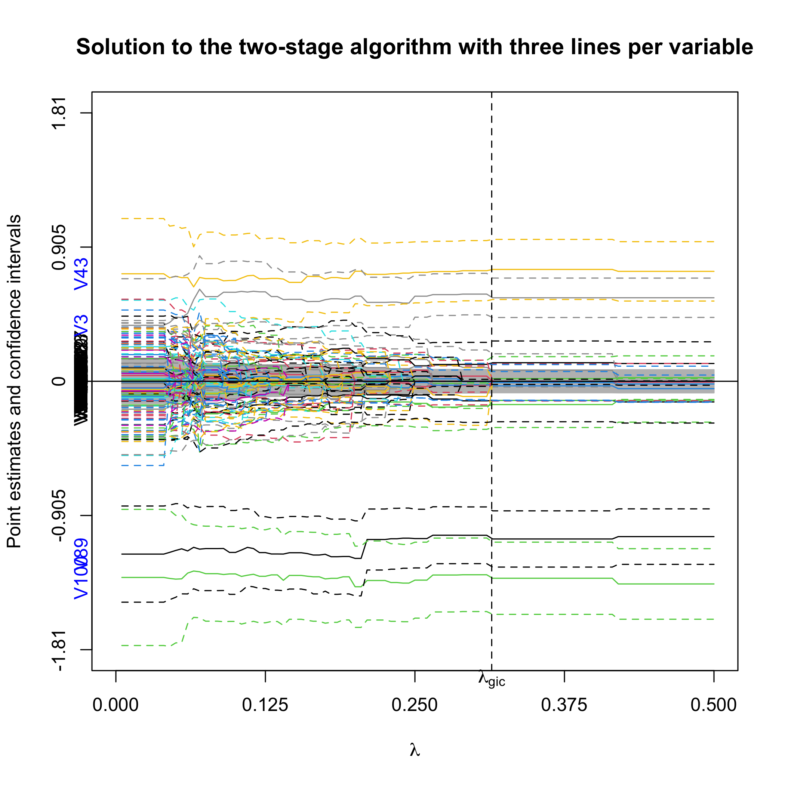
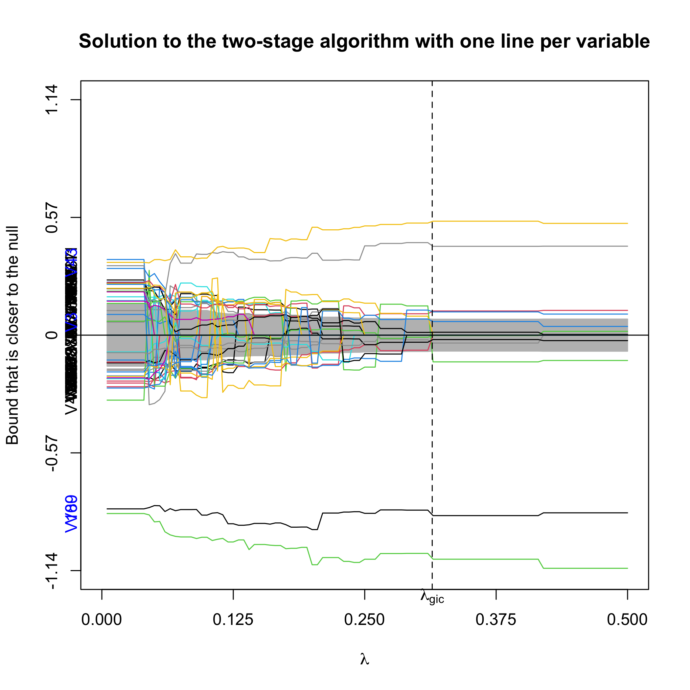

```{r, include = FALSE}
knitr::opts_chunk$set(
  collapse = TRUE,
  comment = "#>"
)
```


# Introduction

`ProSGPV` is a package that performs variable selection with Second-Generation P-Values (SGPV). This document illustrates how `ProSGPV` performs variable selection with data from generalized linear models (GLM) and Cox proportional hazards models. Technical details about this algorithm can be found at @zuo2020variable. 

We will use Logistic regression to illustrate how `ProSGPV` selects variables with a low-dimensional ($n>p$) real-world data example and how to choose models when each run gives you slightly different results. We will use Poisson regression to show how `ProSGPV` works with simulated high-dimensional Poisson data and a visualization tool for the selection process. We will use Cox proportional hazards model to show how a fast one-stage algorithm works with simulated data together with a visualization tool for the one-stage `ProSGPV`.     

To install the `ProSGPV` pacKakge from CRAN, you can do 

```{r,eval=F}
install("ProSGPV")
```

Alternatively, you can install a development version of `ProSGPV` by doing 

```{r,eval=F}
devtools::install_github("zuoyi93/ProSGPV")
```

Once the package is installed, we can load the package to the current environment.  

```{r}
library(ProSGPV)
```

# GLM examples
## Logistic regression

Traditionally, maximum likelihood (ML) has been used to fit a Logistic model. However, when sample size is small or effect sizes are strong, complete/quasi-complete separation may happen, which may inflate the parameter estimation bias by a lot [@albert1984existence;@rahman2017performance]. Recently, @kosmidis2021jeffreys proposed to use a Jeffreys prior to address the separation issue in the Logistic regression, and that is implemented in `ProSGPV` package.  

In this section, we will use a real-world data example to showcase how `ProSGPV` performs variable selection when the outcome is binary. Lower back pain can be caused by a variety of problems with any parts of the complex, interconnected network of spinal muscles, nerves, bones, discs or tendons in the lumbar spine. Dr. Henrique da Mota collected 12 biomechanical attributes from 310 patients, of whom 100 are normal and 210 are abnormal (Disk Hernia or Spondylolisthesis). The goal is to differentiate the normal patients from the abnormal using those 12 variables. The biomechanical attributes include pelvic incidence, pelvic tilt, lumbar lordosis angle, sacral slope, pelvic radius, degree of spondylolisthesis, pelvic slope, direct tilt, thoracic slope cervical tilt, sacrum angle, and scoliosis slope. The data set `spine` can be accessed in the `ProSGPV` package.    

```{r}
x <- spine[,-ncol(spine)]
y <- spine[,ncol(spine)]

sgpv.2s.l <- pro.sgpv(x,y,family="binomial") 

sgpv.2s.l
```

`ProSGPV` selects three out of 12 variables and they are acral slope, pelvic radius, and degree of spondylolisthesis. 

We can get a summary of the model that we selected.  

```{r}
summary(sgpv.2s.l)
```

Coefficient estimates can be extracted by using the `coef` function.  

```{r}
coef(sgpv.2s.l)
```

Prediction in probability can be made by using the `predict` function.

```{r}
head(predict(sgpv.2s.l))
```

## Poisson regression

`gen.sim.data` function is used to generate some high-dimensional ($p>n$) simulation data from Poisson distribution in this section. There are many arguments in the `gen.sim.data` function, as it can generate data with continuous, binary, count, and survival outcomes.  
`n` is the number of observations, `p` is the number of variables, `s` is the number of true signals, `family` can take the value of `"gaussian"`, `"binomial"`, `"poisson"`, and `"cox"`, `beta.min` is the smallest effect size in absolute value, `beta.max` is the largest effect size, `rho` is the autocorrelation coefficient in the design matrix, `nu` is the signal-to-noise ratio in the continuous outcome case, `sig` is the standard deviation in the covariance matrix of the design matrix, `intercept` is used in the linear mean vector of GLM, `scale` and `shape` are parameters in Weibull survival time, and `rateC` is the rate of censoring.  

In this section, we simulate 80 observations with 100 explanatory variables and one count outcome. The number of true signals is four. The smallest log rate ratio is 0.5 and the largest log rate ratio is 1.5. When $p>n$, only the two-stage `ProSGPV` will be used, even if `stage` is set to be 1. 


```{r}
set.seed(1)
data.log <- gen.sim.data(n=80,p=100,s=4,beta.min=0.5,beta.max=1.5,family="poisson")

x <- data.log[[1]]
y <- data.log[[2]]
(true.index <- data.log[[3]])
(true.beta <- data.log[[4]])

sgpv.2s.p <- pro.sgpv(x,y,family="poisson")
sgpv.2s.p
```

We see that the two-stage `ProSGPV` recovered the true support. 

Similarly, the summary of the final model is available by calling `summary`. 

```{r}
summary(sgpv.2s.p)
```

Coefficients can be extracted by `coef`. We see the estimates are pretty close to the truth.  

```{r}
coef(sgpv.2s.p)
```

In-sample prediction can be done as follows.

```{r}
head(predict(sgpv.2s.p))
```

Out-of-sample prediction is also available by feeding data into the `newdata` argument.  

```{r}
set.seed(1)
data.log <- gen.sim.data(n=10,p=100,s=4,beta.min=0.5,beta.max=1.5,family="poisson")

x.new <- data.log[[1]]
y.new <- data.log[[2]]

data.frame(Observed=y.new,Predicted=predict(sgpv.2s.p,newdata=x.new))

```

The prediction agrees with the truth well.  

The selection process can be visualized below. `lambda.max` sets the limit of X-axis. Only effects whose lower bound doesn't reach the null regions are kept. Selected variables are labeled blue on the Y-axis. The vertical dotted line is the $\lambda$ selected by generalized information criterion (@fan2013tuning). 

```{r,eval=F}
plot(sgpv.2s.p,lambda.max = 0.5)
```

{width=80%}

You can also chooses to view only one line per variable by setting `lpv` to be 1. That line is the 95\% confidence bound that is closer to the null.  

```{r,eval=F}
plot(sgpv.2s.p,lambda.max = 0.5,lpv=1)
```

{width=80%}

# Cox regression

In this section, we will use simulated low-dimensional survival data to illustrate how one-stage and two-stage `ProSGPV` select variables, and additional visualization for the one-stage algorithm's selection process.  

`gen.sim.data` is used to simulate 100 observations.   

```{r}
set.seed(1)
data.cox <- gen.sim.data(n=100, p=20, s=4, family="cox", 
                         beta.min=0.5, beta.max=1.5, sig=2)

x <- data.cox[[1]]
y <- data.cox[[2]]
(true.index <- data.cox[[3]])
true.beta <- data.cox[[4]]

sgpv.2s.c <- pro.sgpv(x,y,stage=2,family="cox")
sgpv.2s.c
```

The two-stage algorithm successfully recovered the true support. We can also run a fast one-stage algorithm by setting `stage` to be 1.  

```{r}
sgpv.1s.c <- pro.sgpv(x,y,stage=1,family="cox")
sgpv.1s.c
```

It succeeded as well. `summary`, `coef`, and `predict` are also available for the one-stage `ProSGPV` object.  
 
We can visualize the one-stage selection process by calling the `plot` function.   

```{r,eval=F}
plot(sgpv.1s.c)
```


Effects estimates (in this case log hazards ratios) and corresponding 95\% confidence intervals are plotted for each variable in the full Cox model. Two vertical green bars indicate the null region. Only effects whose confidence bounds do not overlap with the null regions are kept. Selected variables are colored in blue.  

{width=80%}

# Way to address high correlation or dense signals

When the design matrix has high within correlation, or signals are known to be dense in the data, the ProSGPV algorithm yields a null bound that is slightly higher than the noise level, which subsequently affects the support recovery performance by missing some small true effects. One way to address this issue is to replace the constant null bound in the ProSGPV with a generalized variance inflation factor (GVIF)-adjusted null bound. Please see @fox1992generalized for more details on how to calculate the GVIF for each variable in the design matrix. Essentially, we deflate the coefficient estimate standard error of each variable by its GVIF, and thus produce a smaller null bound, which includes more variables in the final selection set. This adjustment is found to be helpful when signals are dense, too.  

# References
