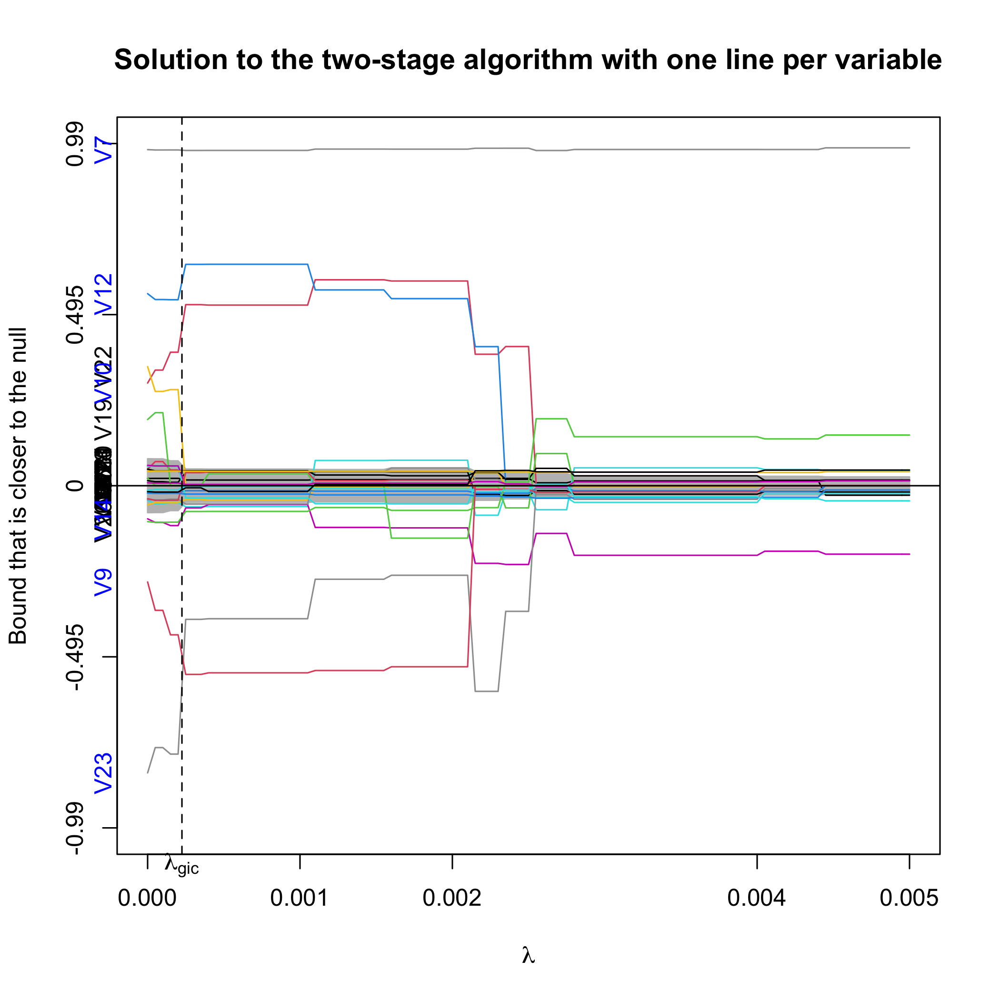

```{r, include = FALSE}
knitr::opts_chunk$set(
  collapse = TRUE,
  comment = "#>"
)
```

# Introduction

`ProSGPV` is a package that performs variable selection with Second-Generation P-Values (SGPV). This document illustrates how `ProSGPV` works with continuous outcomes in linear regression. Technical details about this algorithm can be found at @zuo2020variable. 

To install the `ProSGPV` pacKakge from CRAN, you can do 

```{r,eval=F}
install("ProSGPV")
```

Alternatively, you can install a development version of `ProSGPV` by doing 

```{r,eval=F}
devtools::install_github("zuoyi93/ProSGPV")
```

Once the package is installed, we can load the package to the current environment.  

```{r}
library(ProSGPV)
```

The data set is stored in the `ProSGPV` package with the name `t.housing`. The goal is to find important variables associated with the sale prices of real estate units and then build a prediction model. More details about data collection are available in @rafiei2016novel. There are 26 explanatory variables and one outcome, and variable description is shown below.


| Category   | Label | Description                    | 
| :--------  | :---- | :----------------------------- | 
| Outcome    | V9    | Actual sales price | 
|Project physical and financial features | V2 <br/> V3 <br/> V4 <br/> V5 <br/> V6 <br/> V7 <br/> V8 | Total floor area of the building <br/> Lot area <br/> Total preliminary estimated construction cost <br/> Preliminary estimated construction cost <br/> Equivalent preliminary estimated construction cost in a selected base year <br/> Duration of construction <br/> Price of the unit at the beginning of the project |     
|Economic variables and indices | V11 <br/> V12 <br/> V13 <br/> V14 <br/> V15 <br/> V16 <br/> V17 <br/> V18 <br/> V19 <br/> V20 <br/> V21 <br/> V22 <br/> V23 <br/> V24 <br/> V25 <br/> V26 <br/> V27 <br/> V28 <br/> V29 | The number of building permits issued <br/> Building services index for a pre-selected base year <br/> Wholesale price index of building materials for the base year <br/> Total floor areas of building permits issued by the city/municipality <br/> Cumulative liquidity <br/> Private sector investment in new buildings <br/> Land price index for the base year <br/> The number of loans extended by banks in a time resolution <br/> The amount of loans extended by banks in a time resolution <br/> The interest rate for loan in a time resolution <br/> The average construction cost by private sector when completed <br/> The average cost of buildings by private sector at the beginning  <br/> Official exchange rate with respect to dollars <br/> Nonofficial (street market) exchange rate with respect to dollars <br/> Consumer price index (CPI) in the base year <br/> CPI of housing, water, fuel & power in the base year <br/> Stock market index <br/> Population of the city <br/>  Gold price per ounce|


# Two-stage algorithm

We can load the data and feed into `pro.sgpv` function. By default, a two-stage algorithm is run and prints the indices of the selected variables.


```{r}
x <- t.housing[, -ncol(t.housing)]
y <- t.housing$V9

sgpv.2s <- pro.sgpv(x,y)
sgpv.2s
```

We can print the summary of the linear regression with selected variables with the S3 method `summary`.

```{r}
summary(sgpv.2s)
```

Coefficient estimates can be extracted by use of S3 method `coef`. Note that it returns a vector of length $p$.  

```{r}
coef(sgpv.2s)
```

In-sample prediction can be made using S3 method `predict` and an external sample can be provided to make out-of-sample prediction with an argument of `newdata` in the `predict` function.

```{r}
head(predict(sgpv.2s))
```

The `ProSGPV` selection path can be extracted by use of S3 method `plot`. `lambda.max` argument controls the range of $\lambda$. The black vertical dotted line is the $\lambda$ selected by generalized information criterion (@fan2013tuning). The null zone is the grey shaded region near 0. The blue labels on the Y-axis are the selected variables. 

```{r,eval=F}
plot(sgpv.2s,lambda.max = 0.005)
```

{width=80%}

By default, three lines per variables are provided. You can also choose to view only one bound per variable by setting `lpv` argument to 1, where the one bound is the confidence bound that is closer to 0.

```{r, eval=F}
plot(sgpv.2s, lambda.max=0.005, lpv=1)
```

{width=80%}

# One-stage algorithm

One-stage algorithm is available when $n>p$ but may have reduced support recovery rate and higher parameter estimation bias. Its advantage is its fast computation speed and its result being fixed for a given data set.

```{r}
sgpv.1s <- pro.sgpv(x,y,stage=1)
sgpv.1s
```

Note that the one-stage algorithm selects one more variable than the two-stage algorithm.

S3 methods `summary`, `coef`, `predict` and `plot` are available for the one-stage algorithm. Particularly, `plot(sgpv.1s)` would presents the variable selection results in the full model. Point estimates and 95\% confidence intervals are shown for each variable, and the null bounds are shown in green vertical bars. Selected variables are colored in blue.  

```{r,eval=F}
plot(sgpv.1s)
```


{width=80%}

# High dimensional case where $p>n$

`ProSGPV` also works when $p>n$. This section will show you an example in linear regression. Simulated data are generated by use of function `gen.sim.data`. `gen.sim.data` can generate Gaussian, Binomial, Poisson, and survival data. Details can be found in the corresponding help mannual. In this section, we generated 100 observations with 200 variables in the design matrix, where only four are signals. The goal is to recover the support of those four variables.    

```{r}
set.seed(30)
data.linear <- gen.sim.data(n=100, p=200, s=4)

# explanatory variables
x <- data.linear[[1]]

# outcome
y <- data.linear[[2]]

# true support
(true.index <- data.linear[[3]])

# true coefficients
true.beta <- data.linear[[4]]
```

`ProSGPV` can identify the true support. 

```{r}
h.sgpv <- pro.sgpv(x,y)
h.sgpv
```

Similar to the low-dimensional case, S3 methods `summary`, `coef`, `predict`, and `plot` are available. Below we show the selection path.  

```{r,eval=F}
png("vignettes/assets/linear.fig.4.png", units="in", width=7, height=7, res=300)
plot(h.sgpv)
dev.off()
```

{width=80%}

# Way to address high correlation or dense signals

When the design matrix has high within correlation, or signals are known to be dense in the data, the ProSGPV algorithm yields a null bound that is slightly higher than the noise level, which subsequently affects the support recovery performance by missing some small true effects. One way to address this issue is to replace the constant null bound in the ProSGPV with a generalized variance inflation factor (GVIF)-adjusted null bound. Please see @fox1992generalized for more details on how to calculate the GVIF for each variable in the design matrix. Essentially, we deflate the coefficient estimate standard error of each variable by its GVIF, and thus produce a smaller null bound, which includes more variables in the final selection set. This adjustment is found to be helpful when signals are dense, too.  

# References
